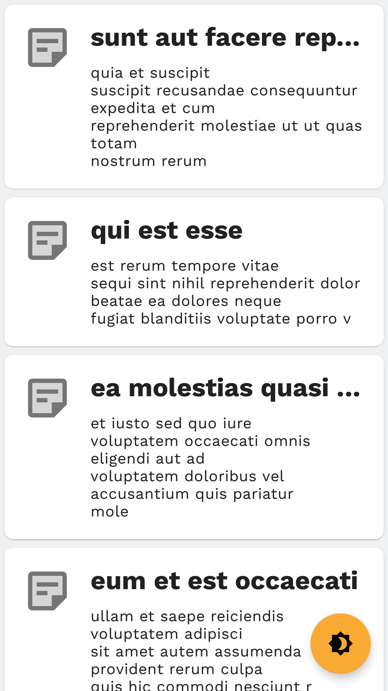
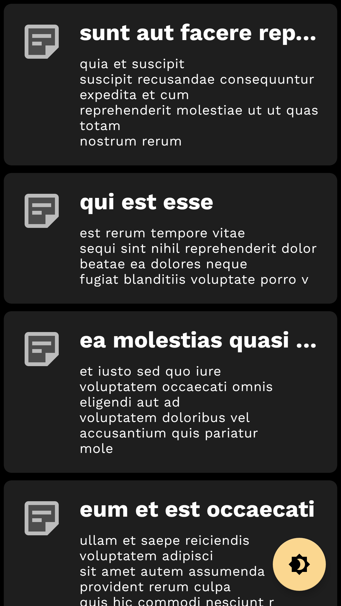
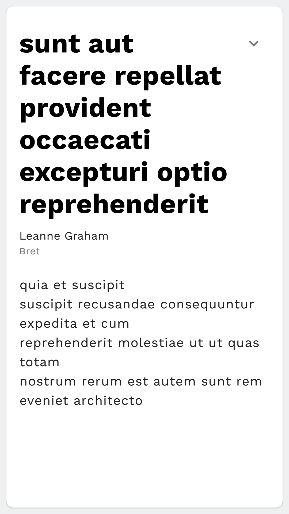
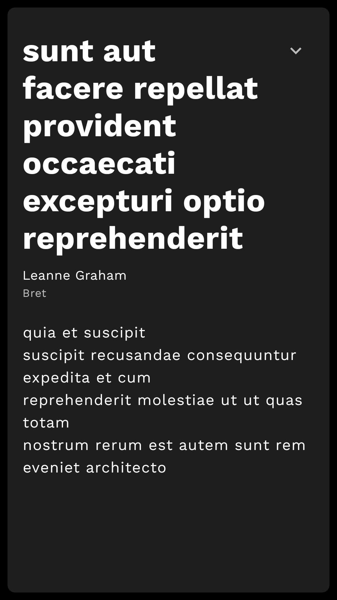

# JustPosts
JustPost app displays a bunch of random posts from [GraphQLZero](https://graphqlzero.almansi.me/)

> GIF Source: [JustPosts_DemoVideo](screenshots/JustsPosts_DemoVideo.mp4)
> 
## Getting Started

In the last week, I developed this nice app using the following tech stack:
- 100% Kotlin
- Architecture: MVVM, CLEAN, SOLID, Repository pattern...
- Jetpack Architecture Components: ViewModel, LiveData, Navigation, Paging 3...
- Coroutines + Flow
- [Apollo Client](https://github.com/apollographql/apollo-android)
- Hilt - Dependency injection
- Material Design Components

## MVVM Architecture

In this section I will explain the MVVM architecture followed and all its different parts:

### UI
First of all, the UI is strongly supported by a solid design system crafted by the **Material Design** library.
Thanks to that, create a consistent design. nice animations/transitions and a **dark theme** in parallel were able to achieve.

This project follows the *Single-Activity pattern*, where **`MainActivity.kt`** its the base Activity. 
From it we can differentiate 2 Fragments:
  1. **`PostsFragment.kt`**: shows the list of posts. It is supported by the **`PostsViewModel.kt`**. It uses **Paging 3** for the pagination system.
  
 
  
  2. **`PostDetailsFragment.kt`**: shows the info details from the selected post. It is supported by the **`PostDetailsViewModel.kt`**.
  
   

### Repository + DataSource

It was built a **`PostRepository.kt`** which consumes from **`GraphQLZeroRemoteDataSource.kt`** that provides with all posts from **`GraphQLZeroClient.kt`** using **Apollo Client**.

### Data Models
In order to keep the UI model (domain model) separate from any DTO model(autogenerated by Apollo Client library), I created 2 UI models:
  * **`Post`**: to display the list in the  `PostsFragment`, and `User` to display it on the `PostDetailsFragment`.
  * **`User`**: to display it on the `PostDetailsFragment`.

In addition, based on [this GraphQL query](app/src/main/graphql/com/cmesquita/technicaltest/justposts/Posts.graphql), I created 2 different mappers:
  * **`PostsResponseDTOMapper`**: to map the response generated by the Apollo Client.
  * **`Data1DTOMapper`**: to map each post from the array of the Apollo Client response.

## Conclusion 

### Resources
Find attach to the project folder a [debug APK](JustPosts_1.1(2)-debug.apk). Alternatively you can build the project using **Android Studio 4.1.2**.

In addition, a few screenshots and a demo video can be found also in the project folder: 
- [JustsPosts_DemoVideo.mp4](screenshots/JustsPosts_DemoVideo.mp4)
- [JustsPosts_HomeScreen_LightTheme.png](screenshots/JustsPosts_HomeScreen_LightTheme.png)
- [JustsPosts_HomeScreen_DarkTheme.png](screenshots/JustsPosts_HomeScreen_DarkTheme.png)
- [JustPosts_PostDetailsScreen_LightTheme.png](screenshots/JustPosts_PostDetailsScreen_LightTheme.png)
- [JustPosts_PostDetailsScreen_DarkTheme.png](screenshots/JustPosts_PostDetailsScreen_DarkTheme.png)

### Final words
I hope you could enjoy my work and could appreciate the effort in it.

Don't hesitate to ask any question if you have.
Have a nice day!
